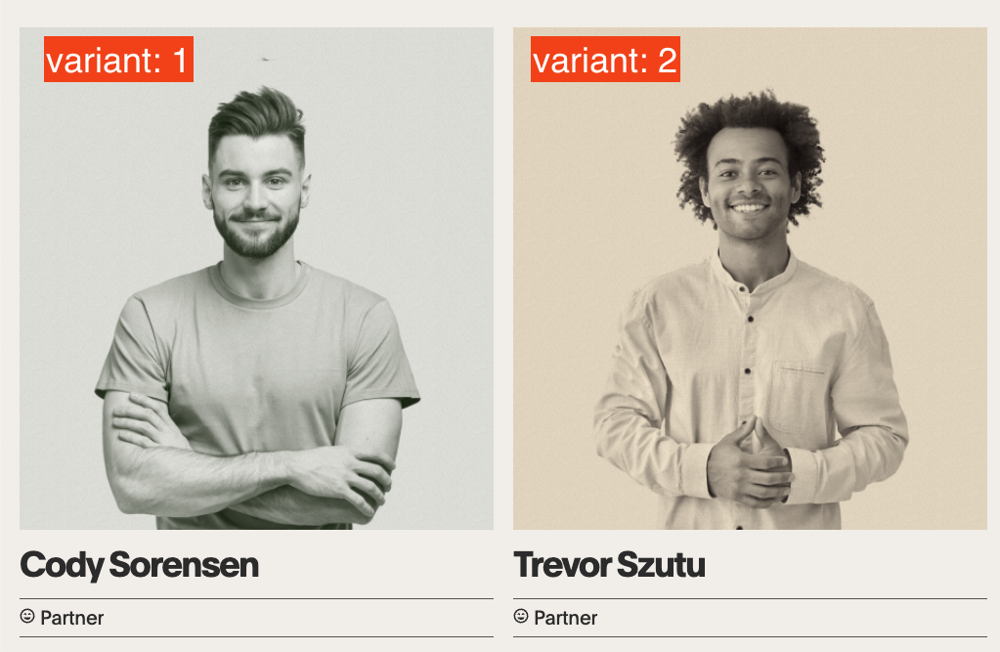

# Adding partner dialog

- paste the content of `partner-dialog.html` into the end of the `body` tag near `#success-dialog`
- add `partner-dialog.js` as a script tag
- add `partner-dialog.css` as a link tag

## Usage

`script.js` will create a global variable `showPartnerDialog` which is a function that takes a single argument `partner` which is an object with the following properties:

```js
showPartnerDialog({
  variant: 1, // 1 or 2 to change the mask color of the image
  name: 'Cory Swanson',
  img: 'https://i0.wp.com/odins-crow.com/wp-content/uploads/2022/10/mate-1.9c41fdad8df8f460d84ea62fa16ec5b0.png?fit=453%2C480&ssl=1',
  content: `
    <p>
      Lorem ipsum dolor sit amet consectetur adipisicing elit. Alias beatae expedita mollitia architecto exercitationem, magnam autem. Veniam, accusantium quibusdam. Consectetur laborum est odio totam sapiente officiis temporibus alias eum aliquid quos ab, recusandae cumque facilis voluptatem eos minima dolores nam sit amet eaque deserunt! Debitis labore libero voluptatibus numquam molestiae.
    </p>
  `,
})
```
### By `onclick` attribute

To add this to a partner card, add the following to the `onclick` attribute of the card:

```html
<div
  class="mate"
  onclick="showPartnerDialog({
    variant: 1, // 1 or 2 to change the mask color of the image
    // if you see a green mask, use 1, if you see a brown mask, use 2, see the screenshot
    name: 'Cory Swanson',
    img: 'https://i0.wp.com/odins-crow.com/wp-content/uploads/2022/10/mate-1.9c41fdad8df8f460d84ea62fa16ec5b0.png?fit=453%2C480&ssl=1',
    content: `
      <p>
        Lorem ipsum dolor sit amet consectetur adipisicing elit. Alias beatae expedita mollitia architecto exercitationem, magnam autem. Veniam, accusantium quibusdam. Consectetur laborum est odio totam sapiente officiis temporibus alias eum aliquid quos ab, recusandae cumque facilis voluptatem eos minima dolores nam sit amet eaque deserunt! Debitis labore libero voluptatibus numquam molestiae.
      </p>
    `,
  })">
  ...
</div>
```



### By `addEventListener`

Or if you don't want to pollute html, you can add `click` event listener to `.mate` cards and call `showPartnerDialog` from there. Some `data-` attribute will make it easier to map the data.

```html
<div class="mate" data-partner="0">
  ...
</div>
```

```js
const MATES = [
  {
    variant: 1,
    name: 'Cory Swanson',
    ...
  },
  ...
]

document.addEventListener('click', e => {
  if (e.target.closest('.mate')) {
    const partner = MATES[e.target.closest('.mate').dataset.partner]
    showPartnerDialog(partner)
  }
})
```